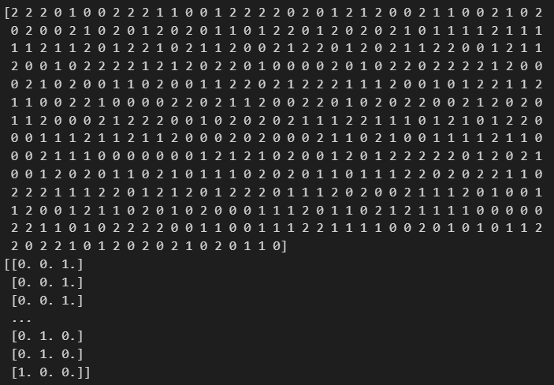
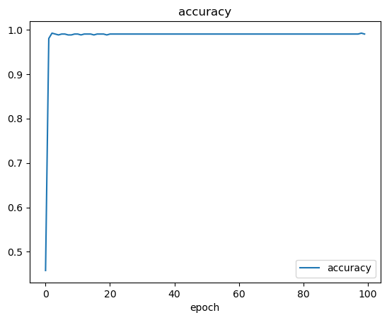
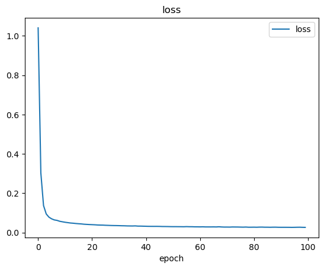
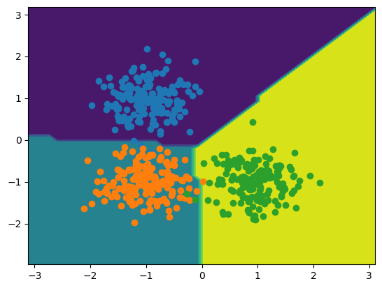
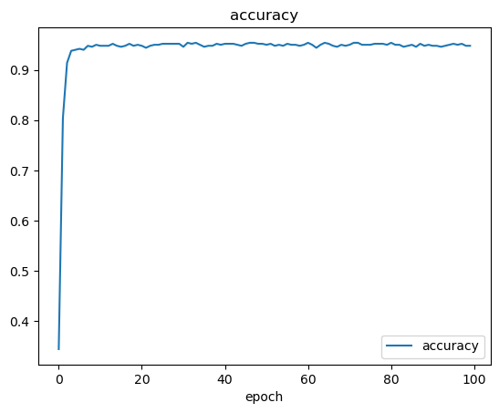
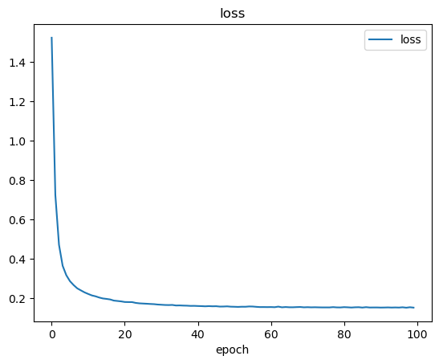
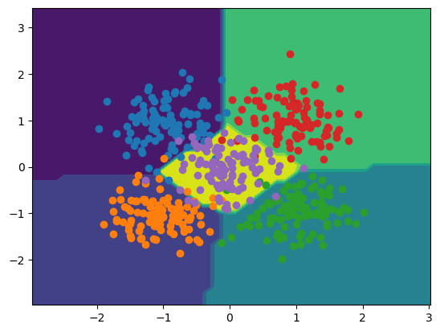

# Multiclass Classification

## Objective 
- Project to implement the Tensorflow and Keras libraries to (supervise) train and test a single layer neural network for multiclass classification
- Dataset was produced using the Sklearn library 

## Method
- Similar method applied to that used in the [Simple Perceptron Model](https://github.com/sebdisiena/Simple-Perceptron-Model?tab=readme-ov-file) and [Simple Keras Perceptron Model](https://github.com/sebdisiena/Simple-Perceptron-Model-Keras) repositories
- Utilised Keras' Adam stochastic gradient descent model  
- Method utilises one input layer of 2 nodes, and an output layer of x nodes to classify the dataset to x number of classes
- Multiclass cross entropy is applied which differs from the binary cross entropy equation
- Hot encoding of labels for dataset was required to eliminate unecessary dependencies within data labels. Output from this method is show below for 3 classes 
  

  

## Results
- Accuracy and loss of 0.9910 and 0.0269 respectively after 100 epochs (for 3 classes) 
  

   
  
- Effectively plotted 3 regions for classification through contour plot and successful in classifying a random inputted data point into the correct class (0)
  

  
  

- Accuracy and loss of 0.9431 and 0.1616 respectively after 100 epochs (for 5 classes) 
  

   
  
- Effectively plotted 3 regions for classification through contour plot
  

  